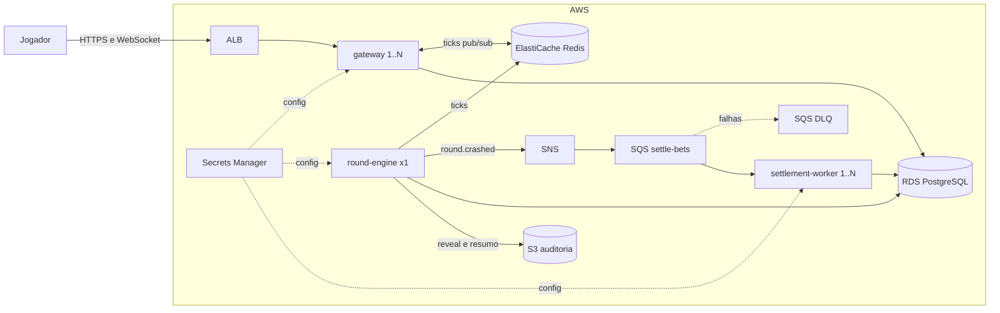

# Arquitetura

Visão do sistema alvo. Cada escolha relevante tem um ADR em `docs/adr/`; este documento junta as peças.

## Visão geral

## Por que três serviços

Com várias réplicas atrás do ALB, o loop da rodada não pode rodar em todas, senão cada réplica sortearia um crash diferente. O `round-engine` é o único dono da rodada (uma réplica); o `gateway` não guarda estado e pode escalar livremente; o `settlement-worker` escala pela profundidade da fila. Ver ADR 0003.

O ponto único do `round-engine` é aceito: se ele cair, o ECS sobe outro e a rodada em andamento é anulada com reembolso, regra que o domínio já precisa ter. Alternativa registrada: eleição de líder com advisory lock no PostgreSQL.

## Consistência

- **Saldo:** derivado de um ledger de lançamentos imutáveis (ADR 0004).
- **Aposta:** criação idempotente pelo header `Idempotency-Key`.
- **Saque contra crash:** lock otimista na aposta e verificação do estado da rodada na mesma transação; quem confirmar primeiro vence, de forma determinística (ADR 0005).
- **Liquidação:** consumo idempotente da fila; mensagem só é removida depois de processada; falhas repetidas vão para a DLQ (ADR 0006).

## Escala

- **Gateway por demanda:** target tracking numa métrica customizada de conexões WebSocket ativas por task, publicada pelo próprio serviço no CloudWatch. CPU e contagem de requisições do ALB não refletem carga de WebSocket (ADR 0009).
- **Gateway por horário:** ações agendadas do Application Auto Scaling ajustam mínimo e máximo de réplicas (mínimo 1 de madrugada).
- **Worker:** escala pela profundidade da fila SQS.
- **Cooldown assimétrico:** sobe rápido, desce devagar.

### Encolher sem derrubar ninguém

1. O ALB tira a task da rotação (deregistration delay) e para de mandar conexões novas para ela.
2. A task recebe SIGTERM e avisa cada cliente com uma mensagem de reconexão antes de fechar.
3. O cliente reconecta pelo ALB, cai numa task saudável e recebe o estado atual da rodada vindo do Redis. Apostas vivem no banco, não na conexão.
4. Deregistration delay, `stopTimeout` da task e o shutdown da aplicação são calibrados juntos; o idle timeout do ALB fica acima do intervalo de heartbeat.

Transporte só WebSocket: o fallback por long polling do Socket.IO exigiria sticky session.

## Prova

Script k6 abre milhares de conexões WebSocket em rampa e depois solta. O README final mostra o gráfico do CloudWatch com as réplicas subindo e descendo e a contagem de conexões perdidas no scale-in, que precisa ser zero ou próxima disso, e explicada.

## Resiliência no portfólio

O portfólio em heronoa.com.br consulta `GET /health`. Sem resposta (stack destruída ou fora do ar), mostra uma simulação no navegador com o mesmo cálculo HMAC verificável.

## Decisões em aberto

Ver `.ia_context/` (handoff mais recente). Entre elas: saída das subnets privadas por NAT Gateway ou VPC endpoints, região da AWS e test runner.
